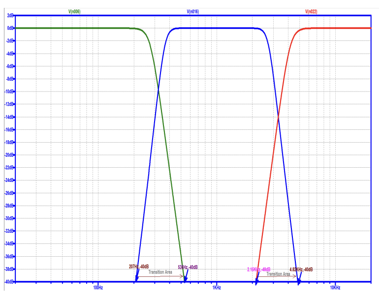

# Speaker System Optimization Using Advanced Passive Filters

This repository contains the project files for the **Speaker System Passive Filter Design**, developed as part of the "Circuits and Fields" module in Semester 03 at the University of Moratuwa. The project focuses on improving the sound quality of a speaker system by designing and implementing new passive filters to reduce the large transition area that caused frequency overlap and distortion.

## Problem Overview

During a live music program, we identified a problem in the speaker system, caused by an outdated crossover network. The large transition area of the filters led to frequency overlap, phase cancellation, and distortion, which significantly reduced sound quality. The goal of this project was to design and implement new passive filters to improve frequency separation and reduce the transition area.

## Solution Approach

- **Filter Design**: We designed new passive filters, including **Low Pass**, **Band Pass**, and **High Pass** filters. 
- **Filter Comparison**: We compared two filter designs—**Butterworth** and **Chebyshev Type I**—to determine the best solution for reducing the transition area while maintaining sound fidelity.
- **Simulation & Analysis**: Using **LTSpice**, we simulated the frequency responses of the designed filters and compared them with the old filter to observe the improvement.

## Technologies Used

- **LTSpice**: For simulating and analyzing the frequency responses of the filters.
- **Butterworth and Chebyshev Filter Designs**: Compared for optimal frequency separation and minimal transition area.
  
## Features

- **Low Pass Filter**: Designed to allow low-frequency signals to pass while attenuating higher frequencies.
- **Band Pass Filter**: Allows a specific range of frequencies to pass while attenuating frequencies outside the range.
- **High Pass Filter**: Allows high-frequency signals to pass while attenuating lower frequencies.
  
The filters were designed to improve the performance of the crossover network in the speaker system, enhancing sound clarity by minimizing phase cancellation and reducing distortion.

## Simulation Results

- The **Butterworth filter** was chosen for its flat passband, ensuring smooth frequency separation with minimal ripple.
- The **Chebyshev filter** offered a sharper cutoff, but at the cost of introducing ripples in the passband, which may affect sound quality.
- Simulation results from **LTSpice** confirmed that the new filters significantly reduced the transition area, leading to improved sound fidelity.

## Bode Plots of the Designed Filters

## Conclusion

The implementation of new passive filters improved the sound quality of the speaker system by reducing distortion and enhancing frequency separation. This project demonstrated the practical application of filter design and circuit analysis in solving real-world audio issues.
